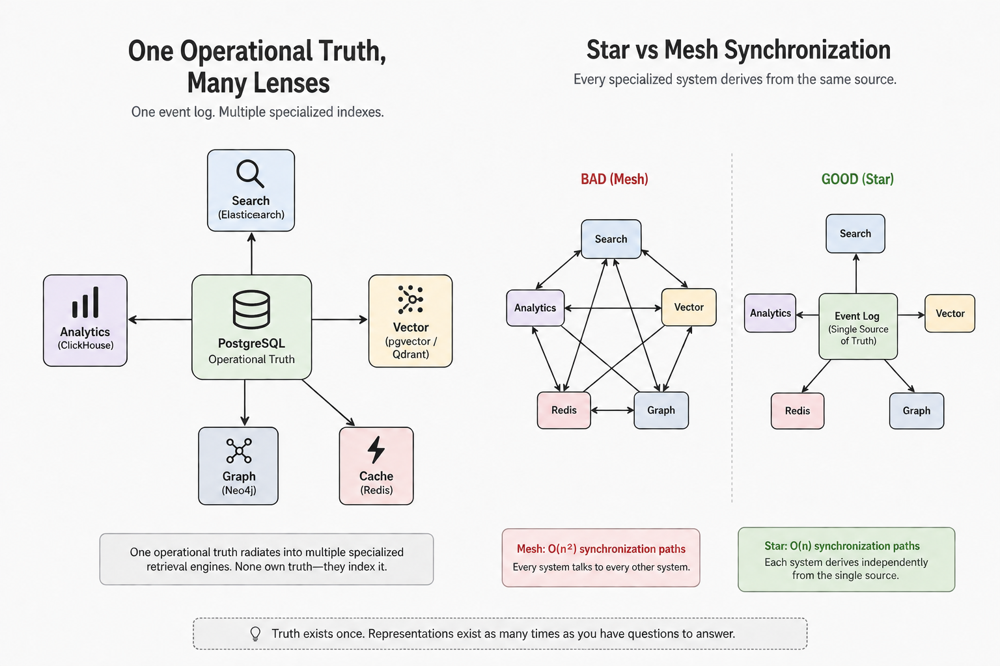

I think most of us learn software architecture backwards.

We begin with databases. SQL. Tables. Normalization. NoSQL. Eventually someone introduces search engines, caches, warehouses, vector databases, graph databases, knowledge graphs, event sourcing, CQRS, and a growing collection of technologies that all seem to promise a better architecture.

After a while, architecture starts to feel like choosing the right storage engine.

It isn't.

The biggest shift in how I think about software didn't come from learning another database. It came from realizing that **reality exists before databases**.

That sounds obvious until you notice how rarely we build systems that way.

Reality doesn't know what a table is. Customers don't generate rows. Payments don't happen because a transaction committed. A restaurant doesn't "update a record." Things simply happen in the world, continuously and independently of whatever software we eventually write to describe them.

Once I started viewing software as an attempt to faithfully capture reality instead of an exercise in choosing technologies, many ideas that had previously felt disconnected suddenly became part of one coherent picture. Domain-Driven Design, Event Storming, event sourcing, CQRS, search indexes, analytics warehouses, vector search, graph databases, even knowledge graphs - all of them stopped looking like separate topics and started looking like different stages in the same evolution.

This article is my attempt to explain that evolution.

Not as a comparison of databases or a shopping list of technologies.

But as a mental model for understanding how modern systems grow — from recording reality, to answering increasingly sophisticated questions about it.

## Reality has no schema

Picture an order coming through on a food delivery app. Someone opens the app. They pick a restaurant. The restaurant accepts. A rider gets assigned. The rider picks up the food. The payment clears. The order arrives.

Every one of those things happened whether Postgres existed or not. Reality doesn't know what a table is. It doesn't know JSON, it doesn't know GraphQL, it doesn't care about your schema migrations. Reality simply unfolds, continuously, with no natural seams.

Software's first job, then, isn't storage. It's deciding **what counts as a fact** — where one discrete, recordable thing ends and the next begins. That decision is a modeling choice, and it happens before any database enters the picture. Get it wrong here, and every layer you build afterward inherits the mistake, because everything downstream is built on top of what you decided was worth recording in the first place.

## Reality becomes events

Once you accept that facts have to be carved out of continuous reality, you're doing event storming whether you call it that or not. You're asking: what actually happened, in the order it happened, described the way a person in the business would describe it — not the way a database schema would.

```
User registered
Order placed
Payment authorized
Payment captured
Driver assigned
Order delivered
```

Notice what's absent. Nothing here says PostgreSQL. Nothing says MongoDB. Nothing even says software. These are business facts, full stop — the kind a restaurant manager or a claims adjuster would recognize without ever having opened a terminal.

This is why people who've done a lot of event sourcing get oddly obsessive about event names. "Payment captured" and "payment processed" sound like the same thing until you've been burned by the difference — one describes a specific, irreversible state transition; the other is vague enough to mean three different things to three different engineers six months from now. The event is your first interpretation of reality, and everything you build later — every derived table, every dashboard, every fraud check — inherits whatever you got right or wrong at this exact step.

## Events become models

Once you know which facts matter, the next question is how they relate to each other conceptually. This is where domain-driven design earns its keep — not as a framework you adopt, but as a language you use to stop confusing storage shape with business meaning.

An order isn't a table. A customer isn't a row. A payment isn't a JSON blob. They're concepts, and the relationships between them are business rules before they're anything else: an order contains line items, a payment belongs to an order, a driver fulfills a delivery.

An aggregate, in this language, is just the boundary around a cluster of facts that has to change together, consistently, as one unit — an order and its line items move together, or not at all, because a half-updated order is a bug, not a valid state. That boundary is a modeling decision, and it holds regardless of what you store it in. You could implement the exact same model in Postgres, in MongoDB, or entirely in memory, and the model would be identical, because the model is the business, and the database is just one implementation of it. This is the distinction that took me the longest to actually internalize: a good model survives a technology migration untouched. A schema tied too tightly to one engine's quirks doesn't.

## The database arrives, later than you'd think

Only now — after reality is discretized into events, and events are organized into a model — does a storage question actually make sense to ask. And for the overwhelming majority of systems, the honest answer is boring: PostgreSQL.

Not because Postgres is flawless. Because starting there delays every decision you don't yet have evidence to make. A single Postgres instance already gives you transactional guarantees, relational modeling, JSON documents when you need document flexibility, full-text search that's good enough for a long while, recursive queries for bounded graph-shaped questions, and decades of hard-won operational knowledge that Stack Overflow has already argued through on your behalf.

Starting with Postgres isn't a limitation you're accepting. It's an optimization against complexity you haven't earned yet. Most architectures I've seen go wrong don't go wrong because Postgres broke — they go wrong because someone assumed scale, or assumed a graph, or assumed a specialized need, before the system produced a single piece of evidence that the assumption was true.

## Truth is expensive, reading is cheap

Here's the idea that reorganized everything else for me: **operational databases own truth. Everything else exists to make asking questions of that truth easier.**

Say your event history looks like this:

```
Order placed
Item added
Item added
Payment captured
Driver assigned
Delivered
```

Now someone asks: how many deliveries completed today? You could replay every event from the beginning of time to answer that. You shouldn't. Instead you derive another representation — a table of completed orders, restaurant, total, completion time, driver — and nobody typed a single row of it by hand. It was computed from the facts that actually happened. If you deleted that table tomorrow, you'd lose nothing important, because you can rebuild it from the log that still exists.

That's the whole idea, stated as plainly as I can put it: **truth exists once. Representations of it can exist as many times as you have questions to answer.**

## Derived models, and why CQRS finally clicked

A derived model, in this frame, is simply another way of looking at the same underlying truth. Finance wants monthly revenue, refund rate, average basket size, revenue by city — numbers nobody entered by hand, all derived from the payments that actually happened. Search wants "find chicken near me," which nobody naturally stores that way, so you derive a search-shaped representation from the restaurants and menus that already exist. A recommendation engine wants "this customer prefers vegetarian restaurants," which emerged from purchase history rather than being typed anywhere.

Derived models aren't copies of your data. They're interpretations of it, each shaped for one class of question.

This reframing is what finally made CQRS make sense to me, after years of it feeling like architecture astronauts inventing abstractions for the sake of having abstractions. Writing and reading are optimizing for genuinely different things. Writing cares about correctness — did this really happen, exactly once, exactly as described. Reading cares about speed and shape — can I answer this specific question fast, in the format that's useful right now. Once you see those as different problems with different constraints, splitting them stops feeling clever and starts feeling obvious. The write side records reality faithfully. The read side reshapes that reality into whatever form answers a useful question quickly. That's it. That's the whole pattern.

The practical version, if you're wiring this up yourself: your event log is truth, fed by something like change data capture or a message bus, and each derived model — a summary table, a search index, a cache — subscribes to that stream and rebuilds its own shape independently, on its own schedule, disposably.

## Stop asking "which database." Start asking "what question."

This is the shift that mattered most. I stopped thinking about databases as a menu of storage engines to choose between, and started thinking about retrieval — every engine is really answering one narrow family of questions, nothing more.

| Question you're asking | What answers it | Typical engine |
|---|---|---|
| Find text containing "pizza" | Full-text index | Elasticsearch |
| Find documents similar to this sentence | Vector index | Qdrant, pgvector |
| Who's connected to whom, how many hops away | Graph index | Neo4j |
| Revenue trend over three years | Analytical index | ClickHouse, DuckDB, BigQuery |
| Give me the shopping cart right now | In-memory index | Redis |

None of these is magic, and none of them owns reality. They index it. Orders, payments, and customers still start their life in Postgres; everything in that table is a lens built afterward, pointed at facts that already exist.

Picture it as one operational truth radiating outward into several equally-important lenses, rather than as a pile of separate databases you're managing:

One operational truth, five lenses — PostgreSQL at the center, search, analytics, vector, graph, and cache lenses as peers, not a hierarchy.




This is also where a term like "institutional memory" stops sounding mystical the moment you look at it closely. It's not a new primitive. It's this same list, wearing a more ambitious name: an operational record, a history of how it got there, a way to find text in it, a way to find things similar to it in meaning, a way to find how it's connected to other things, and a fast place to keep the parts you check constantly. Nothing on that list is a different kind of intelligence. It's seven ordinary lenses on one ordinary truth, and the only thing that's actually new is how cheap it's become to populate some of them from messy, unstructured source material.

## What piles up isn't the number of engines. It's the number of pipelines.

Here's the part that's easy to miss if you're only counting technologies. Five specialized indexes isn't five problems. It's up to ten synchronization pipelines, if you let each index try to stay consistent with every other index directly — and that number grows quadratically as you add more.

The fix is structural, not disciplinary: **every specialized index derives from the same single event log, and none of them talk to each other.** That turns the relationship from a mesh into a star. A star with five lenses needs five one-way feeds. Add a sixth lens, and the star gains one pipeline. The mesh, left unmanaged, gains five more.

Star topology with five one-way feeds from a single event log, versus mesh topology with up to ten pairwise pipelines between five indexes trying to stay consistent with each other directly.


This is the genuinely underrated design decision in all of this. It's not choosing Neo4j over Elasticsearch. It's making sure that when you eventually have six specialized indexes feeding off one business, the complexity you're managing grows in a straight line instead of exploding on you.

One caveat worth stating plainly, because it's easy to reach for a cache as if it were a cheaper derived model: it isn't the same category. A cache like Redis is fit for anything read-heavy, small, and fine with being briefly wrong — session state, rate limits, hot lookups you're happy to recompute on a miss. It's never a substitute for a derived model that needs to be correct, because a cache can always be cold, evicted, or stale by design, and your system has to survive that without corrupting truth. Redis in front of Postgres for hot reads: always fine. Redis as the only place a fact lives: never, because that's simply not the job a cache is doing.

## When graphs actually emerge

Now, finally, the graph question — because by the time you've read this far, a graph is obviously just one more specialized index. Not a destination. Not a different tier of database sitting above the others. A peer to your search index and your vector index, reached for only when the question itself demands it.

Here's the test that actually discriminates, because "everything is connected" is true of almost any business and therefore useless as a filter:

A join answers a bounded, known-hop-count question — get me the orders for this customer, list the patients this doctor referred. Postgres does that forever, cheaply, with an index. A graph answers a question about the *shape* of connections at a hop count you don't know in advance — is there a path, however many steps, connecting these two accounts; does this cluster of relationships form a cycle; who sits at the center of an unusual number of paths. That's a genuinely different computational problem, not a fancier version of the same one, and it's why a graph engine exists at all.

That's why fraud is the first thing that comes to mind for graphs in finance. Money laundering is specifically constructed to defeat single-hop joins — shell companies and layered transactions exist to break the "get me this account's transactions" query, which is exactly why the detection has to ask about paths and cycles instead. It's the same shape as a referral network showing disease spread through a hospital system: "how many degrees separate this cluster of cases" isn't a query with a known hop count, and the topology itself — a hub, an unusual cycle — is the finding, not a side effect of a normal lookup.

Recommendation systems pass the same test in a more subtle way. "Products this customer bought" is a join. "Products bought by people whose purchase behavior connects to this customer two or three hops out, where the shape of that connection is the signal" is graph-shaped — a walk over a bipartite user-item graph. Worth knowing honestly, though: most production recommenders today solve this with embeddings and matrix factorization rather than literal graph traversal, because the topology insight got compressed into a vector space instead. The underlying problem is old and graph-shaped. The dominant modern solution isn't always a graph database.

Which means, in practice, most CRUD systems never need one. If relationships carry more meaning than the entities themselves, and answering the question honestly would mean chaining an unknown number of joins, that's the moment a graph question exists. Until then, it likely doesn't, and building one anyway is solving a problem you don't have yet with a tool that isn't free.

## Are knowledge graphs about giving meaning?

Worth being precise here, because this is exactly where marketing language does real damage if you let it in unexamined. A knowledge graph doesn't give meaning. It encodes a schema — someone decided, in advance, that "referral" is an edge type and "provider" is a node type — and then efficiently answers "find all paths of this shape" against that fixed schema. It understands what a referral means about as much as Postgres understands what a customer is, which is to say, not at all. The understanding was a human decision, made once, at schema design time.

What's genuinely new, and worth taking seriously rather than dismissing along with the hype, is that large language models make entity and relationship extraction from messy, unstructured text cheap for the first time. Pulling "Dr. Smith referred patient X to Dr. Jones for cardiology" out of a free-text clinical note used to require an expensive NLP pipeline; now it's closer to a well-written prompt. That's a real unlock in construction cost. It changes how cheaply you can populate a graph. It does not change what the graph is for, and it does not mean the resulting graph understands anything it didn't before. Keep those two claims — cheaper to build, and understands meaning — permanently apart, because collapsing them into one is exactly how "knowledge graph" turned into a phrase that sounds like intelligence and mostly isn't.

## Where the graph lives, and where it doesn't

The graph is an internal capability of a bounded context — fraud, compliance, referral routing — never a query surface exposed directly to a UI, and never something a caller decides to reach into on their own. A fraud service exposes an ordinary API, something like a risk check against a transaction, and internally decides whether answering it needs a graph traversal, a Postgres join, or a cache hit. The caller — human, dashboard, or an AI agent — never knows or needs to know which. It calls a capability. It doesn't formulate a query language.

This matters more than it sounds like it should, because it's the difference between a graph that quietly does its job inside one service, and a graph that's become a second source of truth everyone pokes at directly, which is exactly the kind of sprawl the star-topology point above is trying to prevent.

## Designing this for real: five services, one delivery app

Enough abstraction. Picture five services behind a food delivery app — user, inventory, order, shipping, payment — and walk through where each retrieval engine actually earns its place, rather than being assumed into existence.

- **Order and inventory** are almost entirely bounded joins. Get this customer's orders, check this item's stock. Postgres, forever, with no drama.
- **Payment and fraud** are where a graph genuinely shows up first, and for a precise reason: "is this transaction's pattern topologically similar to known bad patterns" is an arbitrary-depth, cycle-sensitive question — the same shape as the fraud-ring and referral-network cases above. This might also be where a decision like offering a buy-now-pay-later button at checkout gets influenced by relationship structure that a single join can't see.
- **Shipping** is mostly assembling known entities by ID — user, order, address — which is retrieval, not topology, and stays that way until you add route optimization. Worth being precise that route optimization is a different graph problem entirely: it's pathfinding over a fixed, physical, external road network, closer to Dijkstra than to "does this cluster of my own business data form a suspicious shape." Same word, two structurally different problems — worth not filing both under one lesson just because both get called graphs.
- **Recommendations** follow a maturity sequence rather than reaching for a graph on day one. Early on, they read directly from Postgres or the event log — a join and a count is enough. As query volume and variety grow, an analytics layer gets built — pre-aggregated, columnar, fast for questions like spending by region by order pattern. Only later, if the signal turns out to genuinely be topological rather than just statistical, does a graph or an embedding-space projection get built from that analytics layer. Graph-first, skipping the analytics step entirely, means committing to a relationship schema before you have evidence any particular relationship was the one that mattered.

Every one of these decisions is downstream of the same question this whole piece has been circling: not "which database is best," but "what question am I actually trying to make cheap, and does answering it honestly require a shape no join can give me."

## The mental model, stated plainly

Databases aren't a destination you arrive at once you've learned enough of them. They're not even the interesting part, most of the time. The interesting part is upstream — deciding what counts as a fact, understanding how those facts relate as a business, and only then picking a place for them to live.

Everything after that is a derived representation, built to make one class of question cheap to ask. A search index, a warehouse, a vector store, a graph, a cache — none of them are more advanced than the others, and none of them are where you're supposed to end up. They're peers, chosen because a real question demanded one, not because the question sounded impressive enough to deserve one.

The system I'd actually trust myself to build, and the one I'd trust a junior engineer to inherit without quietly accumulating debt I'll be paying down in two years, starts in exactly this order: model reality honestly, in Postgres, until a specific, evidenced question forces something else. Not before.