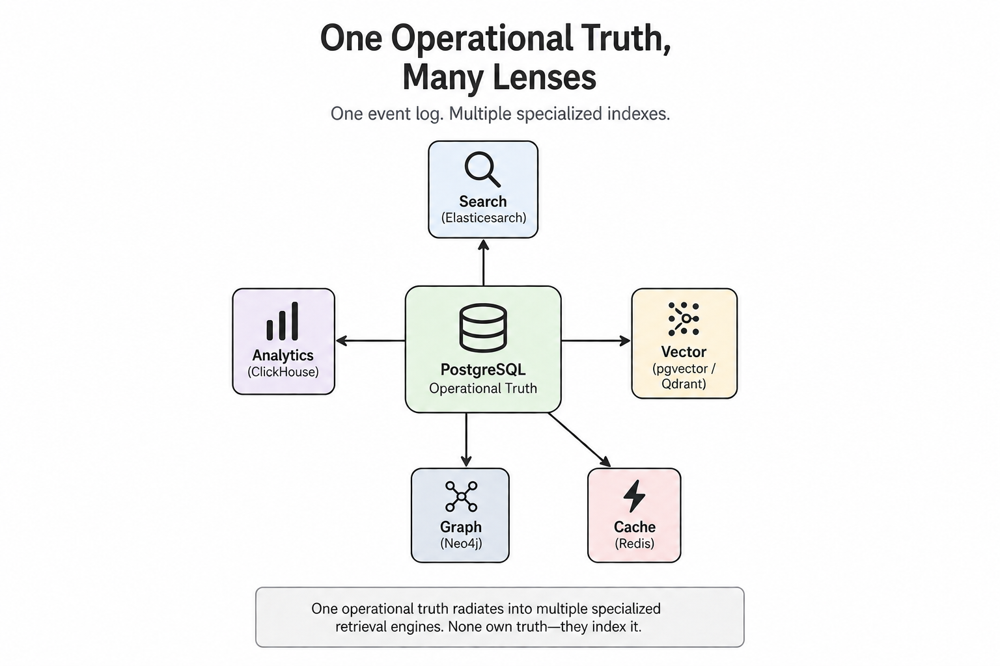
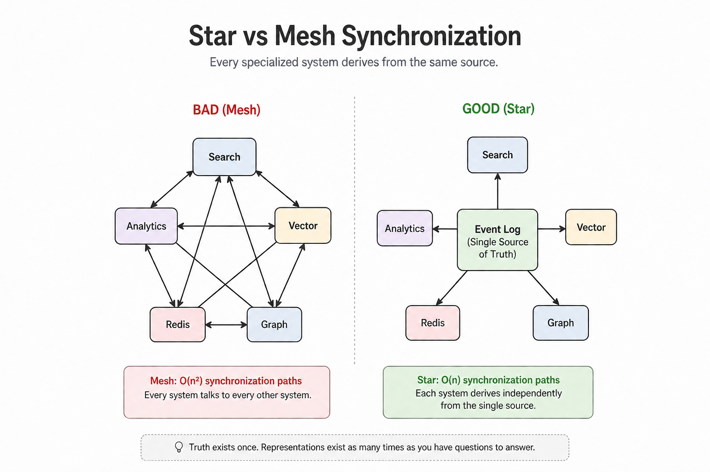

I think most of us learn software architecture backwards.

We begin with databases. SQL. Tables. Normalization. NoSQL. Eventually someone introduces search engines, caches, warehouses, vector databases, graph databases, knowledge graphs, event sourcing, CQRS, and a growing collection of technologies that all seem to promise a better architecture.

After a while, architecture starts to feel like choosing the right storage engine.

It isn't.

The biggest shift in how I think about software didn't come from learning another database. It came from realizing that **reality exists before databases**.

That sounds obvious until you notice how rarely we build systems that way.

Reality doesn't know what a table is. Customers don't generate rows. Payments don't happen because a transaction committed. A restaurant doesn't "update a record." Things simply happen in the world, continuously and independently of whatever software we eventually write to describe them.

Once I started viewing software as an attempt to faithfully capture reality instead of an exercise in choosing technologies, many ideas that had previously felt disconnected suddenly became part of one coherent picture. Domain-Driven Design, Event Storming, event sourcing, CQRS, search indexes, analytics warehouses, vector search, graph databases, even knowledge graphs - all of them stopped looking like separate topics and started looking like different stages in the same evolution.

This article is my attempt to explain that evolution. A mental model I hold for understanding how modern systemss grow from recording reality, to answering increasingly sophisticated questions about it.

## Reality has no schema

Picture an order coming through on a food delivery app. Someone opens the app. They pick a restaurant. The restaurant accepts. A rider gets assigned. The rider picks up the food. The payment clears. The order arrives.

Every one of those things happened whether Postgres existed or not. Reality doesn't know what a table is. It doesn't know JSON or GraphQL, and it doesn't care about your schema migrations. It simply unfolds as a continuous process. It doesn't come pre-divided into records, entities, or events.

Software's first job, then, isn't storage. It's deciding what counts as a fact. Where does one discrete, recordable thing end and the next begin? That decision is a modeling choice, and it happens before any database enters the picture. Get it wrong here, and every layer you build afterward inherits the mistake, because everything downstream is built on top of what you decided was worth recording in the first place.

## Reality becomes events

Once you accept that facts have to be carved out of continuous reality, you're doing event storming whether you call it that or not. You're asking: what actually happened, in the order it happened, described the way a person in the business would describe it - not the way a database schema would.

```
User registered
Order placed
Payment authorized
Payment captured
Driver assigned
Order delivered
```

Notice what's absent. Nothing here says PostgreSQL. Nothing says MongoDB. Nothing even says software. These are business facts, the kind a restaurant manager or a claims adjuster would recognize without ever having opened a terminal.

This is why people who've done a lot of event sourcing get oddly obsessive about event names. "Payment captured" and "payment processed" sound like the same thing until you've been burned by the difference - one describes a specific, irreversible state transition; the other is vague enough to mean three different things to three different engineers six months from now. The event is your first interpretation of reality, and everything you build later - every derived table, every dashboard, every fraud check inherits whatever you got right or wrong at this exact step.

## Events become models

Once you know which facts matter, the next question is how they relate to each other conceptually. This is where domain-driven design earns its keep as a language you use to stop confusing storage shape with business meaning.

An order isn't a table. A customer isn't a row. A payment isn't a JSON blob. They're concepts, and the relationships between them are business rules before they're anything else: an order contains line items, a payment belongs to an order, a driver fulfills a delivery.

An aggregate, in this language, is just the boundary around a cluster of facts that has to change together, consistently, as one unit - an order and its line items move together, or not at all, because a half-updated order is a bug, not a valid state. That boundary is a modeling decision, and it holds regardless of what you store it in. You could implement the exact same model in Postgres, in MongoDB, or entirely in memory, and the model would be identical, because the model is the business, and the database is just one implementation of it. This is the distinction that took me the longest to actually internalize: a good model survives a technology migration untouched. A schema tied too tightly to one engine's quirks doesn't.

## The database arrives, later than you'd think

Only now ... after reality is discretized into events, and events are organized into a model does a storage question actually make sense to ask. And for the overwhelming majority of systems, the honest answer is boring: PostgreSQL.

Starting with Postgres is not flawless but it dellays every decision you don't yet have evidence to make. A single instance gives you transactional guarantees, relational modeling, JSON documents when you need flexibility, full-text search that's good enough for a long whhile, recursive queries for bounded graph-shaped questions, and decades of hard-won operational knowledge with known failure modes.

Starting with Postgres isn't a limitation you're accepting. It's an optimization against complexity you haven't earned yet. Most architectures I've seen go wrong don't go wrong because Postgres broke, they go wrong because someone assumed scale, or assumed a graph, or assumed a specialized need, before the system produced a single piece of evidence that the assumption was true.

## Truth is expensive, reading is cheap

Here's the idea that reorganized everything else for me: **operational databases own truth. Everything else exists to make asking questions of that truth easier.**

Say your event history looks like this:

```
Order placed
Item added
Item added
Payment captured
Driver assigned
Delivered
```

Now someone asks: how many deliveries completed today? You could replay every event from the beginning of time to answer that. You shouldn't. Instead you derive another representation: a table of completed orders, restaurant, total, completion time, driver - and nobody typed a single row of it by hand. It was computed from the facts that actually happened. If you deleted that table tomorrow, you'd lose nothing important, because you can rebuild it from the log that still exists.

That's the whole idea: **truth exists once. Representations of it can exist as many times as you have questions to answer.**

## Derived models

The interesting part isn't that we can derive new models. It's that different people ask fundamentally different questions about the same underlying reality.

Operations wants to know where an order is right now. Finance wants recognized revenue by month. Marketing wants to find customers who repeatedly filled a cart without ever checking out. Compliance wants a complete history of every state transition an order went through.

Those aren't different truths. They're different questions.

If all you've stored is the latest state, many of those questions become impossible. Every update quietly overwrites part of the story. Information disappears simply because the application no longer needs it in its current form. The problem is that you don't know which facts will become valuable tomorrow. Once they're gone, no architecture can bring them back.

Preserving what actually happened keeps your options open. You can reshape those facts into whatever representation best answers the question in front of you, or the question someone hasn't thought to ask yet.

That's what a derived model really is: an interpretation of the same underlying truth, optimized for one particular way of looking at it. A search index, an analytics warehouse, a recommendation model, a dashboard, even a cache all exist for the same reason. None of them owns the truth. They simply make one class of questions easier to answer.

Once I started thinking this way, ideas like CQRS stopped feeling like architectural patterns and started feeling like one possible consequence of the model. Recording what happened and answering questions about what happened have different constraints. Sometimes that naturally leads to separate write and read models. Sometimes it doesn't. The important idea is simpler than the pattern itself: truth exists once, but useful representations of that truth can exist as many times as you need.


## Stop asking "which database." Start asking "what question."

This is the shift that mattered most.  I stopped thinking about databases as competing technologies, and started thinking about them as specialized ways of answering questions. An operational database records what happened. Everything else exists because some questions become dramatically cheaper when you build a representation optimized for answering them.

| Question you're asking | What answers it | Typical engine |
|---|---|---|
| Find text containing "pizza" | Full-text index | Elasticsearch |
| Find documents similar to this sentence | Vector index | Qdrant, pgvector |
| Who's connected to whom, how many hops away | Graph index | Neo4j |
| Revenue trend over three years | Analytical index | ClickHouse, DuckDB, BigQuery |
| Give me the shopping cart right now | In-memory index | Redis |

None of these systems owns the business. They own an access pattern. They index it. The order was still placed once. The payment was still captured once. The customer still exists once. Search, analytics, vectors, graphs, and caches are simply different lenses built over the same underlying facts.



This perspective also explains why so many modern AI architectures sound more mysterious than they really are.

Terms like knowledge graph, memory, retrieval, or institutional memory often describe new combinations of ideas we've already seen. They're different retrieval layers built on top of an operational record, each optimized for a different kind of question. One retrieves by keywords. Another by semantic similarity. Another by relationships. Another by aggregations over time. Another by latency.

The capabilities may be new. The foundation isn't.

Before software can remember, retrieve, reason, or recommend, it has to answer a much simpler question: What actually happened?

Everything else is built on top of that answer.

## The hard part isn't storage. It's synchronization.

Once you start building specialized retrieval systems, another problem quietly replaces the first one.

You're no longer deciding where to store data. You're deciding how every derived representation stays consistent with the underlying truth.

The naïve approach is surprisingly common. Search updates analytics. Analytics updates the graph. The graph invalidates Redis. Redis triggers another service. Every system gradually learns just enough about every other system to keep itself working.

It works—until it doesn't.

With five specialized systems, you've created a web of possible synchronization paths between them. Every new engine introduces another round of coordination, another place for stale data, another failure mode to debug.

The complexity isn't growing because you added another database. It's growing because you added another relationship.

The alternative is much simpler: **every derived system listens to the same operational history, and none of them synchronize with each other.**

Each index independently projects the event stream into the representation it needs. Search builds a search index. Analytics builds aggregates. The graph builds relationships. Redis caches hot reads. None of them owns the facts, and none of them needs to understand how the others work.



The difference is mathematical.

A mesh of systems creates roughly **O(n²)** synchronization paths as every component begins talking to every other component. A star grows **O(n)** instead. Add another retrieval engine and you add exactly one new projection from the operational log—not another round of pairwise integrations.

This is one of the most important architectural decisions in modern systems, yet it rarely gets the attention that new databases do. The long-term cost of a system usually isn't the number of storage engines you've adopted. It's the number of synchronization relationships you've accidentally created.

One final distinction is worth making.

Redis often appears beside search indexes, analytical stores, and graph databases, but it serves a different purpose. A derived model is another durable representation of the truth, optimized for answering a particular class of questions. A cache is simply a temporary performance optimization.

If Redis disappears, the system should become slower, not incorrect. Every cached value must be recoverable from the operational source of truth. That's why Redis belongs on the edge of the architecture, not at its center. A cache can accelerate reads; it should never become the only place a business fact exists.

## When graphs actually emerge

Now, finally, the graph question — because by the time you've read this far, a graph is obviously just one more specialized index. Not a destination. Not a different tier of database sitting above the others. A peer to your search index and your vector index, reached for only when the question itself demands it.

Here's the test that actually discriminates, because "everything is connected" is true of almost any business and therefore useless as a filter:

A join answers a bounded, known-hop-count question — get me the orders for this customer, list the patients this doctor referred. Postgres does that forever, cheaply, with an index. A graph answers a question about the *shape* of connections at a hop count you don't know in advance — is there a path, however many steps, connecting these two accounts; does this cluster of relationships form a cycle; who sits at the center of an unusual number of paths. That's a genuinely different computational problem, not a fancier version of the same one, and it's why a graph engine exists at all.

That's why fraud is the first thing that comes to mind for graphs in finance. Money laundering is specifically constructed to defeat single-hop joins — shell companies and layered transactions exist to break the "get me this account's transactions" query, which is exactly why the detection has to ask about paths and cycles instead. It's the same shape as a referral network showing disease spread through a hospital system: "how many degrees separate this cluster of cases" isn't a query with a known hop count, and the topology itself — a hub, an unusual cycle — is the finding, not a side effect of a normal lookup.

Recommendation systems pass the same test in a more subtle way. "Products this customer bought" is a join. "Products bought by people whose purchase behavior connects to this customer two or three hops out, where the shape of that connection is the signal" is graph-shaped — a walk over a bipartite user-item graph. Worth knowing honestly, though: most production recommenders today solve this with embeddings and matrix factorization rather than literal graph traversal, because the topology insight got compressed into a vector space instead. The underlying problem is old and graph-shaped. The dominant modern solution isn't always a graph database.

Which means, in practice, most CRUD systems never need one. If relationships carry more meaning than the entities themselves, and answering the question honestly would mean chaining an unknown number of joins, that's the moment a graph question exists. Until then, it likely doesn't, and building one anyway is solving a problem you don't have yet with a tool that isn't free. Until that moment arrives, a graph database is just another piece of infrastructure waiting for a problem.

## Are knowledge graphs about giving meaning?

This is worth being precise about, because it's exactly where marketing language starts to blur important distinctions.

A knowledge graph doesn't give meaning to data. People do.

Someone decides that **Patient**, **Provider**, and **Referral** are concepts worth modeling. Someone decides that *referred to* is a relationship. The graph simply stores those decisions efficiently and answers questions about them.

In that sense, it understands what a referral means about as much as Postgres understands what a customer is: not at all.

The meaning lives in the model. The graph executes it. What has genuinely changed is the cost of building those models.

Until recently, turning messy text into structured entities and relationships meant building specialized NLP pipelines. Extracting "Dr. Smith referred Patient X to Dr. Jones for cardiology" from a clinical note was an engineering project of its own.

Large language models have made that extraction dramatically cheaper. That's a real breakthrough.

It changes how easily we can populate graphs from unstructured information. It doesn't change what graphs fundamentally are, or what they're good at.

Those are two separate claims:

- LLMs make graph construction cheaper.
- Graphs still answer graph-shaped questions.

Confusing those ideas is how "knowledge graph" acquired an aura of intelligence that the underlying technology never claimed for itself.

## Where the graph lives

One final point completes the picture.

A graph is an implementation detail of a capability, not a capability in its own right.

A fraud service exposes a **risk assessment**. A referral service exposes **provider matching**. A compliance service exposes **case investigation**.

None of those APIs says "query the graph."

Internally, the service is free to decide how to answer the request. It might traverse a graph, execute a SQL query, consult Redis, perform vector search, or combine all of them. That's an implementation decision.

The caller shouldn't know. More importantly, the caller shouldn't have to care.

Whether the caller is a web application, another service, or an AI agent, it asks for a business capability, not access to storage. That separation is what keeps the architecture coherent.

The moment multiple services begin querying each other's specialized indexes directly, the clean star topology starts collapsing back into the synchronization mesh we worked so hard to avoid. Specialized indexes stop being derived views and quietly become competing sources of truth.

That's why the graph belongs inside a bounded context. It's simply another retrieval engine, answering one particular family of questions on behalf of the capability that owns those questions.

## What this looks like in practice

Enough abstraction. Picture five services behind a food delivery app — user, inventory, order, shipping, payment — and walk through where each retrieval engine actually earns its place, rather than being assumed into existence.

- **Order and inventory** are almost entirely bounded joins. Get this customer's orders, check this item's stock. Postgres, forever, with no drama.
- **Payment and fraud** are where a graph genuinely shows up first, and for a precise reason: "is this transaction's pattern topologically similar to known bad patterns" is an arbitrary-depth, cycle-sensitive question — the same shape as the fraud-ring and referral-network cases above. This might also be where a decision like offering a buy-now-pay-later button at checkout gets influenced by relationship structure that a single join can't see.
- **Shipping** is mostly assembling known entities by ID — user, order, address — which is retrieval, not topology, and stays that way until you add route optimization. Worth being precise that route optimization is a different graph problem entirely: it's pathfinding over a fixed, physical, external road network, closer to Dijkstra than to "does this cluster of my own business data form a suspicious shape." Same word, two structurally different problems — worth not filing both under one lesson just because both get called graphs.
- **Recommendations** follow a maturity sequence rather than reaching for a graph on day one. Early on, they read directly from Postgres or the event log — a join and a count is enough. As query volume and variety grow, an analytics layer gets built — pre-aggregated, columnar, fast for questions like spending by region by order pattern. Only later, if the signal turns out to genuinely be topological rather than just statistical, does a graph or an embedding-space projection get built from that analytics layer. Graph-first, skipping the analytics step entirely, means committing to a relationship schema before you have evidence any particular relationship was the one that mattered.

Every one of these decisions is downstream of the same question this whole piece has been circling: not "which database is best," but "what question am I actually trying to make cheap, and does answering it honestly require a shape no join can give me."

## Conclusion

Databases aren't where software begins. They arrive surprisingly late. Software begins with deciding what happened, what counts as a fact, and how those facts relate to the business you're trying to model. Everything after that is a consequence. Postgres records operational truth. Search, analytics, vectors, graphs, and caches don't compete with it; they derive from it, each making one family of questions cheaper to answer. They're not milestones on some architectural ladder, and they're not signs of maturity. They're tools you earn when the questions you're asking genuinely require them.

That's the mental model I wish I'd learned first. It turns a landscape of seemingly unrelated ideas—Domain-Driven Design, event sourcing, CQRS, warehouses, knowledge graphs, retrieval, even much of today's AI infrastructure—into different expressions of the same principle. Record reality honestly. Let truth exist once. Derive everything else from it only when there's evidence you need to. Everything else is an optimization. Everything else can wait.
